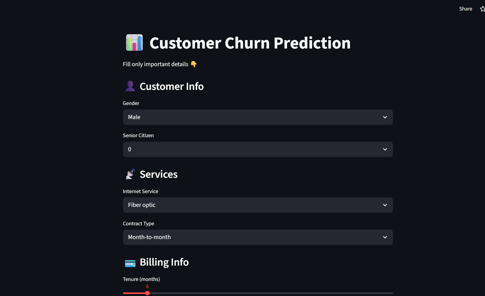
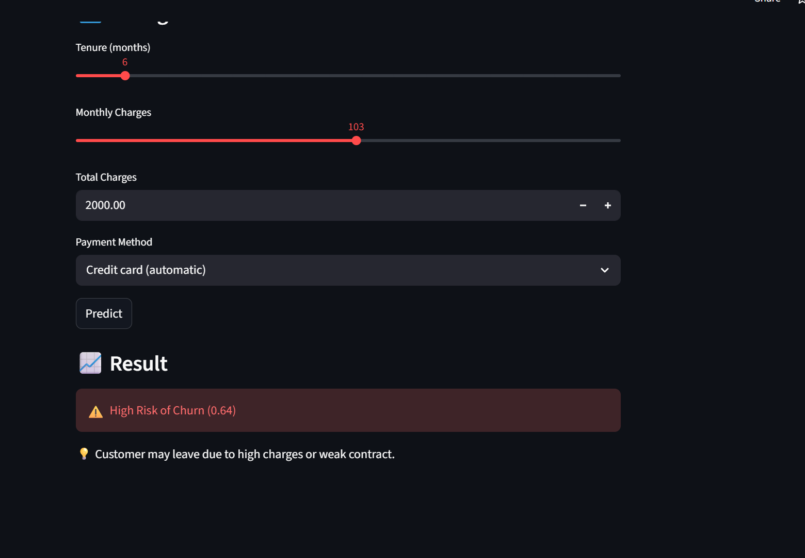

# 📊 Customer Churn Prediction App


---

This is a Machine Learning web app built using Streamlit that predicts whether a customer will churn or not.

---

## 🚀 Live Demo
[](https://customer-churn-prediction-ml-qtzjzroqqo8tgyxzvzdaf3.streamlit.app/)

👉 https://customer-churn-prediction-ml-qtzjzroqqo8tgyxzvzdaf3.streamlit.app/

---

## 📸 Screenshots

<p align="center">
  
  
</p>

---

## 🧠 Project Overview
Customer churn prediction helps businesses identify customers who are likely to leave their service.

This model is trained on telecom customer data and predicts churn based on key features like:
- Tenure  
- Monthly Charges  
- Contract Type  
- Internet Service  
- Payment Method  

---

## 📈 Model Details
- Algorithm: **Random Forest Classifier**  
- Data Scaling: **MinMaxScaler**  
- Imbalance Handling: **SMOTE**  
- Evaluation Metrics: Accuracy, Precision, Recall  

---

## 🖥️ Features
- Simple and clean UI  
- Real-time prediction  
- Probability score display  
- Reduced input fields for better UX  

---

## ⚙️ Tech Stack
- Python 🐍  
- Scikit-learn  
- Pandas  
- NumPy  
- Streamlit  

---

## ▶️ How to Run Locally

```bash
git clone https://github.com/Omjee_31/customer-churn-prediction-ml.git
cd customer-churn-prediction
pip install -r requirements.txt
streamlit run app.py
